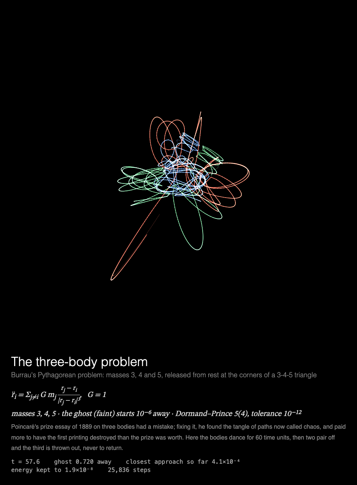

# MMM-ThreeBody

A [MagicMirror²](https://magicmirror.builders/) module that draws the three-body problem as a long exposure, three stories of Newton's gravity in turn, each with a ghost of the same bodies started a millionth away, drawn for a Raspberry Pi without a GPU.



## What you see

**The three-body problem**, where Poincaré found chaos in 1889: three masses pulling on one
another by Newton's law, drawn as a long exposure, with a faint ghost of the same bodies started
10⁻⁶ away. Each showing tells one of three stories, in turn:

- **Burrau's Pythagorean problem** (1913): masses 3, 4 and 5, released from rest at the corners
  of a 3-4-5 triangle, dance through a tangle of near-collisions; then two pair off and the
  third is thrown out, for ever. The ghost follows, then leaves.
- **Lagrange's triangle** (1772): three equal masses circling at the corners of an equilateral
  triangle. It is unstable: the ghost's triangle breaks up after a few turns, and the real one
  a few turns later, from nothing but rounding errors.
- **The figure-eight** (Moore 1993; Chenciner and Montgomery 2000): three equal masses chasing
  one another round one curve. It is stable: the ghost stays with it.

Each story runs for 54–58 s, then the finished picture holds until the module is shown again.
Under it: the equation of motion, the masses, a short history of the story, and the readout:
the time, how far the ghost is from the real bodies, the closest approach so far, how well
energy has been kept, and the integrator's steps.

Built for a **Raspberry Pi 3 without GPU acceleration**: everything is drawn by the CPU, each
frame adds only the bodies' newest stretch of trail, the module rests once the story is told,
and the animation stops while the module is hidden (see [Performance](#performance)).

## Installation

```bash
cd ~/MagicMirror/modules
git clone https://github.com/charleswest775/MMM-ThreeBody
```

No npm dependencies: there is nothing to install.

## Update

```bash
cd ~/MagicMirror/modules/MMM-ThreeBody
git pull
```

## Configuration

```js
{
	module: "MMM-ThreeBody",
	position: "middle_center",
	config: {
		cycleSeconds: 600,  // longer than the page is shown: one story per showing
		width: 900,
		height: 900,
		fps: 20
	}
},
```

The stories take turns **across showings**: each time the module is shown (or every
`cycleSeconds`, if it is shown for longer) it starts the next one, Burrau's problem, then
Lagrange's triangle, then the figure-eight, and round again. Within one showing there is only
one story. Each takes 54–58 s to tell, so **a page of about 60 s** suits it: on a 30 s page
Burrau's bodies are still dancing when the page moves on (the third is thrown out ~45 s in),
and Lagrange's real triangle hasn't broken yet (~50 s in; its ghost's goes within ~30 s).

| Option | Default | Description |
|---|---|---|
| `threeBodyScene` | taking turns | Always this story: `"pythagorean"`, `"lagrange"` or `"figure-eight"` |
| `cycleSeconds` | `60` | Start the next story this often; the next one also starts each time the module is shown again |
| `width`, `height` | `900` | Canvas size in pixels |
| `fps` | `20` | Frame-rate cap |
| `showMath` | `true` | Equations and live numbers under the canvas |
| `turns` | `null` | Take turns with other modules on the same page, e.g. `{ of: 2, at: 1 }` (see [Taking turns](#taking-turns)) |
| `statsPanel` | `false` | A line under the math showing what the mirror spends: fps, CPU of Electron and the compositor, a bar per core, temperature. Sampled by the module's `node_helper` from `/proc`, only while the module is shown |
| `debugStats` | `false` | Show achieved fps and per-frame timings in the corner of the screen |

## Taking turns

With `turns: { of: n, at: k }`, modules on the same [MMM-pages](https://github.com/edward-shen/MMM-pages)
page each show on their own one in n showings of it: `at: 0` on the first showing and every
nth after it, `at: 1` on the second, and so on. A module that isn't on its turn takes no room on
the page and costs nothing: it hides its canvas and doesn't start. So one slot in the rotation
can hold several pages, without making the rotation longer. For example, the three bodies and
[MMM-ChaoticBilliards](https://github.com/charleswest775/MMM-ChaoticBilliards)' long exposures
of balls on two tables, one per showing of a 60 s page:

```js
{
	module: "MMM-ThreeBody",
	classes: "page-chaos",
	position: "middle_center",
	config: { turns: { of: 2, at: 0 } }
},
{
	module: "MMM-ChaoticBilliards",
	classes: "page-chaos",
	position: "middle_center",
	config: { turns: { of: 2, at: 1 } }
},
{
	module: "MMM-pages",
	config: { modules: [["page-clock"], ["page-chaos"]], rotationTime: 60000 }
},
```

The stories still take turns among themselves, one per showing of this module. Without `turns`
the module shows every time. It works just as well on a page of its own, or in a normal region
without MMM-pages, where it moves on to the next story every `cycleSeconds`.

## What's real

Three point masses in a plane, pulling on one another by Newton's law with G = 1:

r̈ᵢ = Σⱼ≠ᵢ G mⱼ (rⱼ − rᵢ) / |rⱼ − rᵢ|³

integrated by Dormand and Prince's adaptive Runge–Kutta 5(4), which estimates each step's error
from the difference of its fifth- and fourth-order results and shrinks or grows the step to keep
it under 10⁻¹², so it follows the close encounters. The ghost is the same system
with the first body moved 10⁻⁶ to the side, integrated alongside. Simulated time runs at 1–1.4
units a second, depending on the story.

The starting states: Burrau's masses 3, 4, 5 at rest at (1, 3), (−2, −1), (1, −1), each opposite
the side of its own length; the figure-eight's published initial conditions (period 6.3259);
and Lagrange's triangle on the unit circle, each body going round at 3^(−1/4),
where the other two pull it towards the centre just enough (period 2π·3^(1/4)).

The tests check that energy, momentum and angular momentum are kept over each story; that
Burrau's problem ends as Szebehely and Peters found in 1967, with masses 4 and 5 bound as a pair
and 3 escaping faster than it could fall back, after close encounters nearer than 10⁻³; that the
figure-eight returns to its start after one period and its ghost stays within 10⁻³; that
Lagrange's triangle returns after one turn, its ghost's triangle has broken by t = 40 while the
real one still holds to 10⁻⁴, and the real one has broken by t = 72; and that each showing takes
the next story.

## Performance

Measured on a Raspberry Pi 3 B+ (Electron 42, software rendering), 900×900 at 20 fps, as CPU of
the Electron processes plus the `cage` compositor, in % of one core (the Pi has four); baseline
mirror without the module: 0.2%.

| | % of one core |
|---|---|
| module **hidden** (e.g. another MMM-pages page) | 0.3 |
| over a 60 s showing (Burrau's problem and Lagrange's triangle) | 76 |

Each frame strokes only the six short segments the bodies and their ghosts have moved since the
last one, onto the long exposure already there, so the part of the canvas that changes is small;
a body thrown far off the picture stops being drawn. Once the story is told the module rests.

Why it costs what it does, from micro-benchmarks on the Pi:

- There is no GPU acceleration to be had (the Pi 3's GPU only does GLES 2.0; Chromium needs
  3.0), so every pixel is drawn by the CPU.
- Any frame that changes the canvas costs ~2% of a core per fps, before drawing anything.
- On top of that, cost grows with the **area that changes**: Chromium redraws the bounding box
  of everything touched in a frame. So the picture is a long exposure: nothing is cleared, only
  the newest stretch of trail is added.
- JavaScript is not the bottleneck: step and draw take 0.1–3 ms per frame.
- The frame loop sleeps with `setTimeout` until a frame is due. Once the story is told the
  module rests, and is only polled twice a second. While MagicMirror² fades the module out,
  nothing new is drawn; once it is hidden, the loop stops.

## Development

```bash
node --test              # conservation laws, Burrau's outcome, periodic orbits (no dependencies)
python3 -m http.server   # then open http://localhost:8000/dev/preview.html
```

`dev/preview.html` runs the module outside MagicMirror², in a portrait 1200×1920 frame, with
hide/show buttons that follow MagicMirror²'s suspend/resume order; "next sim" starts the next
story. Query options override the config, e.g. `?threeBodyScene=lagrange` or
`?threeBodyScene=figure-eight&fps=30`.

## License

MIT

Part of a family of MagicMirror² modules. The chaos simulations, each on its own:
[MMM-LorenzAttractor](https://github.com/charleswest775/MMM-LorenzAttractor),
[MMM-DoublePendulum](https://github.com/charleswest775/MMM-DoublePendulum),
[MMM-FractalBasins](https://github.com/charleswest775/MMM-FractalBasins),
[MMM-LogisticMap](https://github.com/charleswest775/MMM-LogisticMap),
[MMM-SymmetricIcons](https://github.com/charleswest775/MMM-SymmetricIcons),
[MMM-ChaoticBilliards](https://github.com/charleswest775/MMM-ChaoticBilliards) and
[MMM-Rule30](https://github.com/charleswest775/MMM-Rule30), or all eight in one:
[MMM-ChaosTheory](https://github.com/charleswest775/MMM-ChaosTheory).
And more pages of physics and mathematics:
[MMM-Atom](https://github.com/charleswest775/MMM-Atom),
[MMM-FractalZoom](https://github.com/charleswest775/MMM-FractalZoom),
[MMM-Chladni](https://github.com/charleswest775/MMM-Chladni),
[MMM-SacredGeometry](https://github.com/charleswest775/MMM-SacredGeometry),
[MMM-Tilings](https://github.com/charleswest775/MMM-Tilings),
[MMM-PlanetsDance](https://github.com/charleswest775/MMM-PlanetsDance),
[MMM-SnowCrystal](https://github.com/charleswest775/MMM-SnowCrystal) and
[MMM-NightSky](https://github.com/charleswest775/MMM-NightSky).
